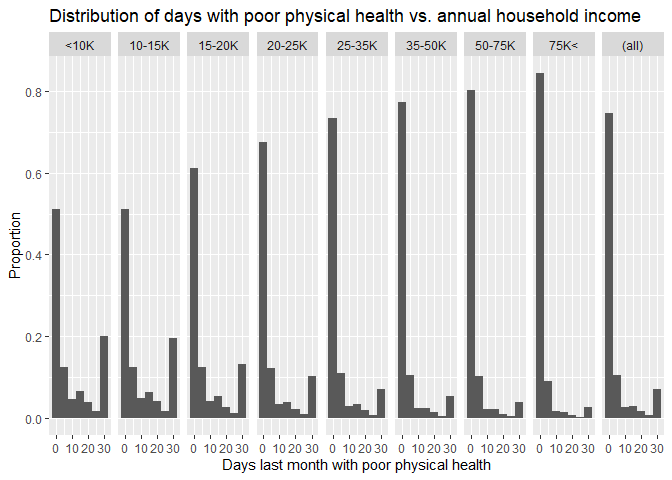
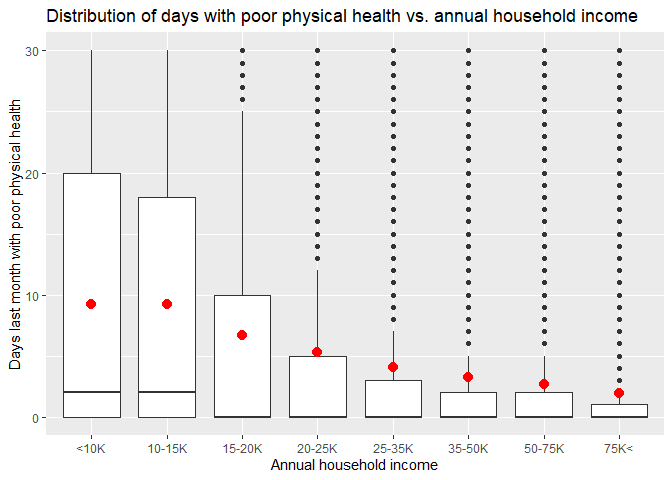
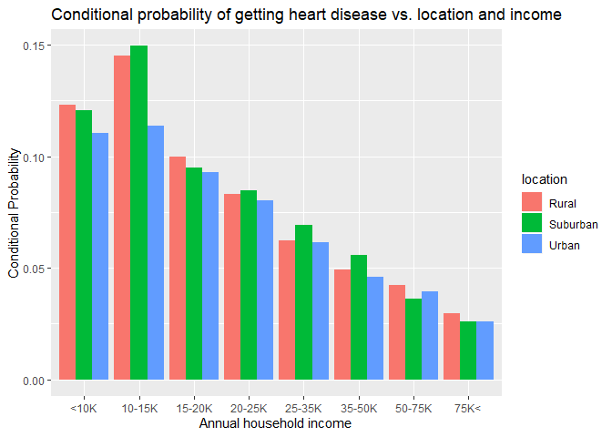
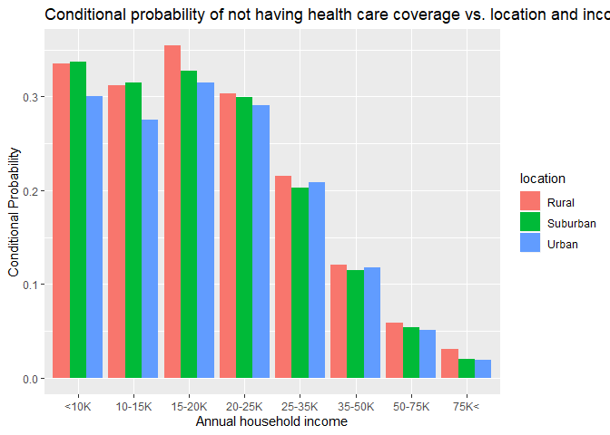

Health, income, and healthcare coverage in the US
================
Ian Finneran
September 1, 2019

### Load packages and data

``` r
library(ggplot2)
library(dplyr)
library(tidyr)
load("brfss2013.RData")
```

-----

## Data

-----

The Behavioral Risk Factor Surveillance System (RBRFSS) is a survey
conducted using random dialing to landlines and cell phones in the US.
In 2013 there were 491,773 participants. The data is generalizable to
people in the US who have a phone, are 18 years old or older, and who
are not institutionalized. Since it is observational, we cannot
establish casual connections between variables, but we can establish
associations.

## Research questions

**Research question 1:**

What are the associations between wealth and health for people in the
US? Age is a confounding variable in this analysis, so we’ll only select
adults between the ages of 18 - 64 years old. I think it is important to
examine the general health of people at different income levels in the
US as we get closer to the next election.

**Research question 2:**

Heart disease is one of the leading causes of death in the US,
[according to the
CDC.](https://www.cdc.gov/nchs/products/databriefs/db328.htm) How does
the conditional probability of getting heart disease compare for
different income levels and locations (urban, suburban, rural). Does
location or income have a greater influence on these probabilities?
Again, I’ll restrict the analysis to 18 - 64 year old people in the US.

**Research question 3:**

What is the conditional probability of not having health care coverage
for different income levels of 18 - 64 year old people in the US? Do low
income people have the least amount of coverage? Or does Medicaid
provide sufficient coverage for low income households? In this question
I am interested in comparing the levels of coverage to the general
health of people from different income levels examined in questions 1
and 2.

-----

**Research quesion 1:**

First, I’ll do some prelminary cleaning of the data. I use the variable
X\_age65yr to filter for adults who are 18 - 64 years old. Then, I
select the variables physhlth (number of days in the last month with
poor physical health) and income2 (annual household income). The income
categories for income2 are also renamed for better readability.

``` r
df <- brfss2013 %>%  filter(X_age65yr=="Age 18 to 64") %>% select(physhlth,income2) %>% 
  drop_na(physhlth,income2)
levels(df$income2) <- c("<10K","10-15K","15-20K","20-25K","25-35K","35-50K","50-75K","75K<" )
```

Next, I’ll get some statistics on the dataset including mean, standard
deviation, Q1, Q2, and Q3 for each income level.

``` r
df_2 <- df %>%
  group_by(income2) %>%
  summarise(count = n(), mean = mean(physhlth), 
            sd = sd(physhlth), 
            Q1 = quantile(physhlth,0.25), 
            Q2 = quantile(physhlth,0.5), 
            Q3 = quantile(physhlth,0.75))
df_2
```

    ## # A tibble: 8 x 7
    ##   income2 count  mean    sd    Q1    Q2    Q3
    ##   <fct>   <int> <dbl> <dbl> <dbl> <dbl> <dbl>
    ## 1 <10K    18301  9.26 11.9      0     2    20
    ## 2 10-15K  15380  9.20 11.8      0     2    18
    ## 3 15-20K  20260  6.69 10.5      0     0    10
    ## 4 20-25K  23805  5.32  9.59     0     0     5
    ## 5 25-35K  28250  4.08  8.42     0     0     3
    ## 6 35-50K  39309  3.23  7.46     0     0     2
    ## 7 50-75K  47268  2.65  6.65     0     0     2
    ## 8 75K<    93813  1.92  5.50     0     0     1

There is a clear association between annual household income and days
with poor physical health. The mean monotonically increases from 1.9 to
9.3 days going from the highest to lowest income levels. This change is
even more visible in Q3, which spans 1 to 20 days. Since the mean is
greater than the median (Q2), the distribution is heavily right skewed.
Let’s take a look at the distrubutions directly with histograms for each
income level.

``` r
p <- ggplot(df, aes(x=physhlth)) + 
  geom_histogram(
    binwidth = 5, 
    aes(y = (..count..)/tapply(..count..,..PANEL..,sum)[..PANEL..])) +
  facet_grid(. ~ income2,margins=TRUE ) + 
  xlab("Days last month with poor physical health") + 
  ylab("Proportion") + 
  ggtitle("Distribution of days with poor physical health vs. annual household income")
p
```

<!-- -->

This confirms the distrubutions for each income level are all right
skewed. 0-5 days is the largest peak for each income level, and it
increases quite rapidly going from lower to higher income levels. It’s
important to note that the bump at 30 is an artifact of the survey
question, as it represents all of the people who have been in poor
physical health for more than one month. Finally, let’s visualize this
with a boxplot.

``` r
ggplot(df, aes(x=income2, y=physhlth)) + 
  geom_boxplot()  +   
  stat_summary(fun.y=mean, geom="point", shape=20, size=5, color="red", fill="red") + 
  xlab("Annual household income") + 
  ylab("Days last month with poor physical health") + 
  ggtitle("Distribution of days with poor physical health vs. annual household income")
```

<!-- -->

These boxplots look a little strange as the cutoff is 30 days and there
is enough data to have every point greater than Q3 filled with an
outlier. However, it is interesting to see the position of Q3 and the
mean shift lower as you go from lower to higher incomes. Overall, these
plots show that people with lower incomes (within this sample) in the US
have poorer overall physical health than people with higher incomes.

**Research quesion 2:** I’ll filter the dataset for 18 - 64 year olds
again, and select the features mscode (metropolitan status code),
income2 (annual household income), cvdinfr4 (ever diagnosed with heart
attack), and cvdcrhd4 (ever diagnosed with angina or coronary heart
disease). Again, I’ll rename income levels for readability.

``` r
df_3 <- brfss2013 %>%  filter(X_age65yr=="Age 18 to 64") %>% 
  select(mscode,income2,cvdinfr4,cvdcrhd4) %>% drop_na(mscode,income2,cvdinfr4,cvdcrhd4)
levels(df_3$income2) <- 
  c("<10K","10-15K","15-20K","20-25K","25-35K","35-50K","50-75K","75K<" )
```

I make a new column called heart disease that is “Yes” if someone has
said yes to either cvdinfr4 or cvdcrhd4. Then I define Urban as “Outside
the center city of an MSA but inside the county containing the center
city”, “In the center city of an MSA”, or “In an MSA that has no center
city”. Suburban is defined as “Inside a suburban county of the MSA” and
Rural is defined as “Not in an MSA”.

``` r
df_4 <- mutate(df_3, heart_disease = ifelse(cvdinfr4=="Yes" | cvdcrhd4=="Yes", "Yes", "No")) %>%
  mutate(location = 
  ifelse(mscode=="Not in an MSA","Rural",
  ifelse(mscode=="In the center city of an MSA" | 
  mscode=="Outside the center city of an MSA but inside the county containing the center city" | 
  mscode=="In an MSA that has no center city","Urban",
  ifelse(mscode=="Inside a suburban county of the MSA","Suburban","None")))) %>% 
  select(location,income2,heart_disease)
```

Finally, I group by income, location, and heart disease and summarise
with the counts in each category and the conditional probability for
heart disease. The results are plotted with a vertical barplot with
categories for each income and subcategories for location. The
conditional probabilities are of the form: P(heart disease|income level
and location).

``` r
df_4 %>%
  group_by(income2,location,heart_disease) %>%
  summarise(n = n()) %>%
  mutate(freq = n / sum(n)) %>% filter(heart_disease=="Yes") %>% 
  select(income2,location,freq) %>%
  ggplot(aes(fill=location, y=freq, x=income2)) + 
    geom_bar(position="dodge", stat="identity") + 
  xlab("Annual household income") + 
  ylab("Conditional Probability") + 
  ggtitle("Conditional probability of getting heart disease vs. location and income")
```

<!-- -->

From this plot, we can see that the conditional probability for getting
heart disease decreases going to higher incomes, with a distinct bump at
10-15k annual household income. There is a much weaker association with
urban/suburban/rural areas, although rural areas tend to have slightly
higher rates of heart disease.

**Research quesion 3:**

For the last question, I start by filtering for 18 to 64 year old
people, and then select the variables mscode (rural/suburban/urban),
income2 (annual household income), and hlthpln1 (have any health care
coverage).

``` r
df_5 <- brfss2013 %>%  filter(X_age65yr=="Age 18 to 64") %>% 
  select(mscode,income2,hlthpln1) %>% drop_na(mscode,income2,hlthpln1)
levels(df_5$income2) <- c("<10K","10-15K","15-20K","20-25K","25-35K","35-50K","50-75K","75K<" )

df_6 <- mutate(df_5,location = 
  ifelse(mscode=="Not in an MSA","Rural",
  ifelse(mscode=="In the center city of an MSA" | 
  mscode=="Outside the center city of an MSA but 
  inside the county containing the center city" | 
  mscode=="In an MSA that has no center city","Urban",
  ifelse(mscode=="Inside a suburban county of the MSA","Suburban","None")))) %>% 
  select(location,income2,hlthpln1) %>%
  filter(location!="None")
```

Next, I plot the conditional probability of not having health care
coverage for the different income levels and locations. The bars
represent the probability P(not having health care coverage|income and
location).

``` r
df_6 %>%
  group_by(income2,location,hlthpln1) %>%
  summarise(n = n()) %>%
  mutate(freq = n / sum(n)) %>% filter(hlthpln1=="No") %>% select(location,income2,freq) %>%
   ggplot(aes(fill=location, y=freq, x=income2)) +
   geom_bar(position="dodge", stat="identity") + 
   xlab("Annual household income") + 
   ylab("Conditional Probability") + 
   ggtitle("Conditional probability of not having health care coverage vs. location and income")
```

<!-- -->

There is a clear decrease in health care coverage for low income
households. High income households have less than a 5% chance of not
having health care coverage, while that climbs to above 30% for some low
income brackets. There is also a trend of rural households having a
greater chance of not having health care coverage than their urban and
suburban counterparts.

Overall this analysis shows that low income houses in the US tend to
have higher rates of physical health problems, including heart disease,
and they also tend to have the lowest rates of healthcare coverage.
Thus, we are still in need of health care coverage that is affordable
for everyone.
